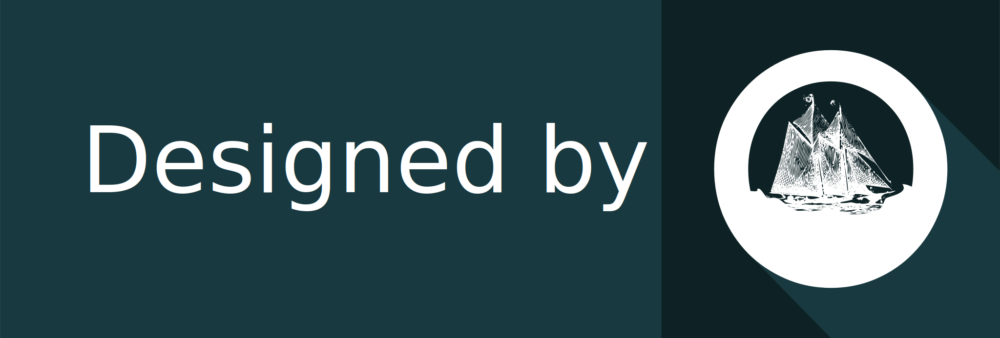

Telecommunication Icon-Sets
================

## About the project

This is an Icon-sets for Telecommunications for public use. You can find
all the files in SVG format. The purpose of this project is to publish
the icons for multiple, public or private use without restrictions with
GNU lisence. You can contribute to them since work is being done to make
the repository complete and to install it by npm for use in apps,
software or web pages.

## The icon-set

You can view some of the first icons:

If you want to contribute, you are welcome

